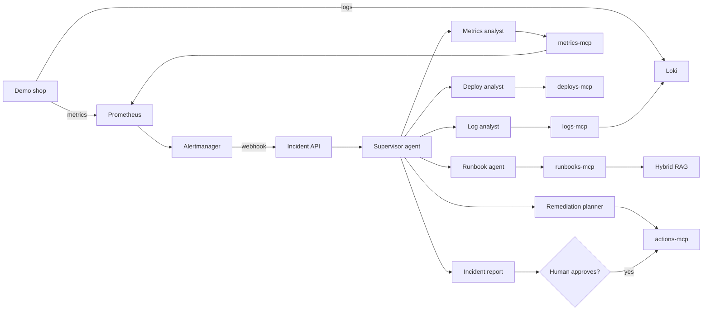

# Architecture

The system turns an alert into a cited incident report and an approval-gated action.

```mermaid
flowchart LR
  A[Demo shop] -->|metrics| P[Prometheus]
  A -->|logs| L[Loki]
  P --> AM[Alertmanager] -->|webhook| API[Incident API]
  API --> S[Supervisor agent]
  S --> LA[Log analyst] --> M1[logs-mcp] --> L
  S --> MA[Metrics analyst] --> M2[metrics-mcp] --> P
  S --> DA[Deploy analyst] --> M3[deploys-mcp]
  S --> RA[Runbook agent] --> M4[runbooks-mcp] --> RAG[Hybrid RAG]
  S --> RP[Remediation planner] --> M5[actions-mcp]
  S --> R[Incident report] --> H{Human approves?}
  H -->|yes| M5
```
